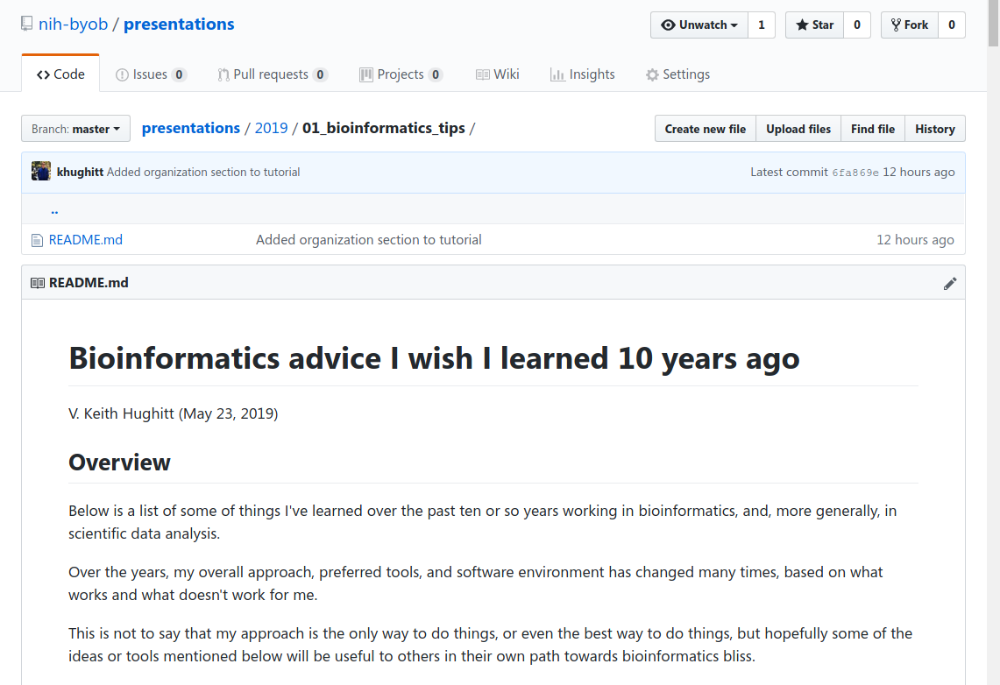

## Why BYOB?

> 1. Many people working along the spectrum from Biology
      to Computer Science.
> 2. There are some good meetings for people working in these areas (e.g. CBMG
     and CBCB RIPs).
> 3. However, some people's work may not fit nicely into either of these.
> 4. RIPs/JCs are typically focused on research and not on the tools used along
     the way.
> 5. Also, few socially-oriented meetings directed at people across this spectrum
     currently exist.

---

## Goals

> 1. Bring people with shared interests across the spectrum
      together to share ideas, help each other out and also to learn what
     each other is doing.
> 2. Short, practical tutorials and presentations for the 1st half of meeting.
> 3. Discussion and socializing in 2nd half of meeting.
> 4. Have fun.

---

## Who?

> - Anyone who is either working on or interested in topics that fall along this
spectrum: students, faculty, post-docs, technicians, etc
> - Both those with experience and those who are interested.

---

## Presentations

Presentations will typically be short (15-45 minutes) and may fall into a
couple different categories:

1. Low-level, focused tutorial on how to perform some
   particular task.
2. High-level, broad tutorial describing some
   interesting tool or technology and how it might be used.

Of course, not all presentations will fall into these categories, and that's
okay too.

---

## Topics Covered

BYOB will include a very wide range of topics:

> - Bioinformatics
> - Computational Biology
> - Data analysis
> - Programming
> - Statistics
> - Visualization
> - Software Engineering
> - Open Science and Reproducible Research

---

## Example Tutorials

> - Visualization in R using ggplot2
> - Batch correction for RNA-Seq (ComBat, etc)
> - Network visualization with Cytoscape
> - Working with IGV
> - Working effectively on clusters (PBS, etc)
> - Setting up a good Bash profile
> - Tree visualization using Python + ETE
> - An introduction to unit testing
> - Annotating genomes using HMMER, Pfam, and GO

---

## Example Tutorials (cont.)

> - Debugging Python code using IPyhon + PDB
> - Making presentations using Slidify
> - Collaboration using Git and Github
> - Running Linux as a virtual machine
> - An introduction to clustering in R
> - Finding motifs using Biopython
> - Working remotely using VNC
> - Journal club / algorithm break-down

---

## Github

All of the materials from presentations given at BYOB will be made available
on Github:

---

## Mailing list

A UMD-BYOB Google Group has been created to make announcements about upcoming
presentations.

<iframe src='http://groups.google.com/forum/#!forum/umd-byob' height='600px'></iframe>

---

## Website

A full schedule will also be made available at http://www.umiacs.umd.edu/~keith/byob/.

<iframe src='http://www.umiacs.umd.edu/~keith/byob/' height='650px'></iframe>

--- .middle

## Done!

Questions / Ideas?

