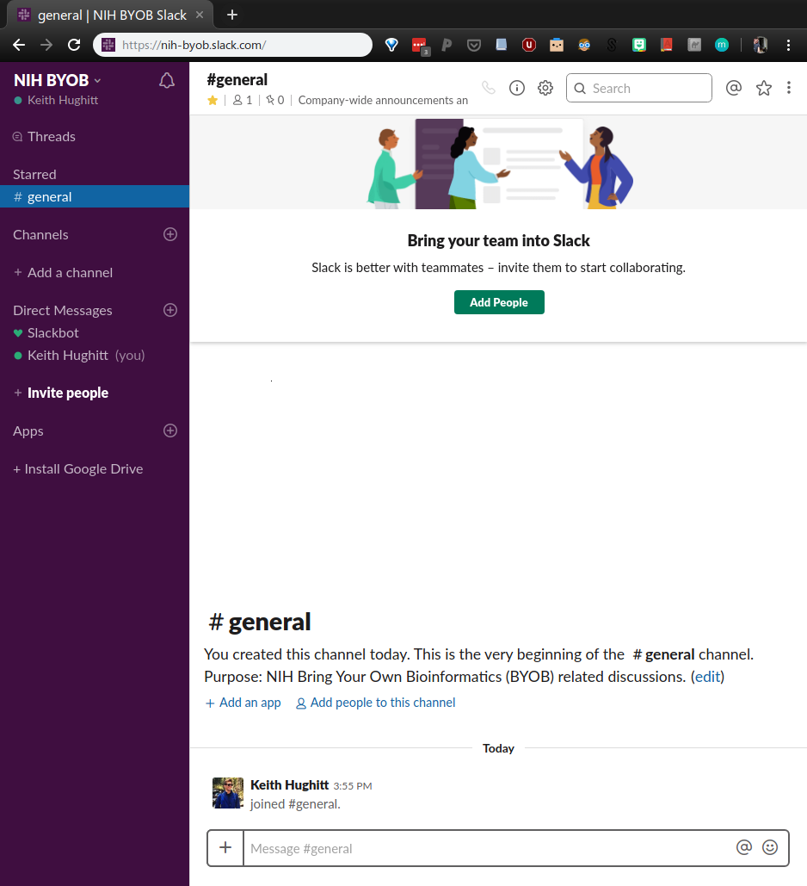

## Why BYOB?

> 1. Many people working along the spectrum from Biology
      to Computer Science at NIH.
> 2. There are already some great meeting series covering topics along these lines at
     NIH...
> 3. However, most of these (research talks, journal clubs, etc.) tend to be focused on research,
     and not on the tools and methods used along the way.
> 4. It's likely that many people are solving the same problems, indepdendently
     throughout NIH.
> 5. Also, few socially-oriented meetings directed at people across this spectrum
     currently exist.

*Slides adapted from an earlier version of this presentation [here](http://khughitt.github.io/slidify-byob-intro/#1)
style="position: absolute; bottom: 40px; font-size:10px; color='#666666'"

---

## Goals

> 1. Bring people with shared interests across the spectrum
      together to share ideas, help each other out and also to learn what
     each other is doing.
> 2. Short, practical tutorials and presentations
> 3. Discussions relating to the presentation (and anything else on people's minds..)
> 4. Have fun.

---

## Who?

> - Anyone who is either working on or interested in topics that fall along this
spectrum: researchers, students, post-docs, technicians, etc
> - Both those with experience and those who are interested.

---

## Presentations

Presentations will typically be short (15-45 minutes) and may fall into a
couple different categories:

1. Low-level, focused tutorial on how to perform some
   particular task.
2. High-level, broad tutorial describing some
   interesting tool or technology and how it might be used.

Of course, not all presentations will fall into these categories, and that's
okay too.

---

## Topics Covered

BYOB will include a very wide range of topics:

> - Bioinformatics
> - Computational Biology
> - Data analysis
> - Programming
> - Statistics
> - Machine Learning
> - Software pipelines
> - Visualization
> - Software Engineering
> - Reproducible Research

---

## Upcoming talks

- **Thurs May 23**  [B1C208] _Introduction / "Bioinformatics advice I wish I learned 10 years ago"_ (Keith Hughitt)
- **Thurs June 20** [B1C211] _Using Singularity Containers for Reproducible Research_ (Henoke Shiferaw)
- **Thurs July 18** [B1C208] _Long reads: from mapping to genome assembly_ (Arang Rhie)
- **Thurs Aug  22** [B1C211] _Organizing Data Science Projects_ (Justin Fear)
- **Thurs Sept 19** [B1C211] _Making better use of Biowulf storage_ (Tim Miller)

---

## Github

All of the materials from presentations given at BYOB will be made available
on:

- 

---

## Slack

A NIH-BYOB Slack channel has been created to allow the discussions to continue after the
meeting ends:

- [nih-byob.slack.com](https://join.slack.com/t/nih-byob/shared_invite/enQtNjMwNzYyMTIxMzc5LWZhNmE1NjU2OGM4Zjc5YTY2OTRhOGU1YWMxNzQwNzcxZWI5NzM4NWE5YmZiZWIyNGI2MmRhNzJlYTE4MDY4OTM)

---

## Related efforts: 

### Seminars

- [Biowulf Classes and Seminar Series](https://hpc.nih.gov/training/)
- [NCI CBIIT Data Science Seminar Series](https://datascience.cancer.gov/news-events/events?event_category_id=66)
- [NLM Informatics and Data Science Lecture Series](https://news.nnlm.gov/psr-newsbits/category/informatics/)

### Courses & Training

- [NCI CBIIT Bioinformatics & Computational Genomics Training](https://cbiitsolutions.cancer.gov/news-events/training)
- [NCI CCR Bioinformatics Training & Education Program (BTEP)](https://btep.ccr.cancer.gov/)

---

## Related efforts: 

### Community-led Meetings

- [NIH Programmers Corner](https://abcsfrederick.info/Events)
- [NIH Bioinformatics User Forum](https://abcsfrederick.info/Events)

### Mailing Lists

- [NIH Bioinformatics Special Interest Group (BSIG)](https://oir.nih.gov/sigs/bioinformatics-scientific-interest-group)
- [NIH Data Science Special Interest Group](https://oir.nih.gov/sigs/data-science-biomedicine-interest-group)

--- .segue .dark

## Questions / Ideas?

